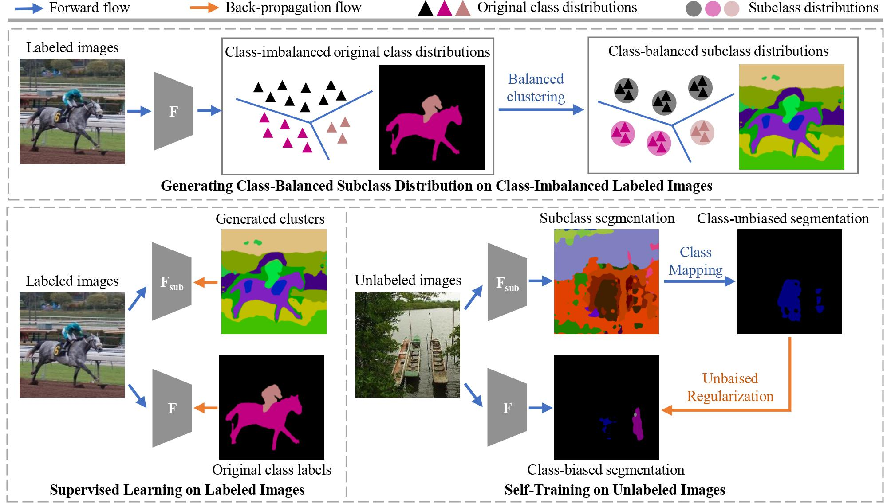

# [CVPR 2022] Unbiased Subclass Regularization for Semi-Supervised Semantic Segmentation

### Updates
- *03/2022*: Codes has been released! Two 2080Ti or single V100-32G are used for PASCAL VOC, Four 2080Ti or two V100-32G are used for Cityscapes.


### Paper


[Unbiased Subclass Regularization for Semi-Supervised Semantic Segmentation](https://dayan-guan.github.io/pub/USRN.pdf)

[Dayan Guan](https://scholar.google.com/citations?user=9jp9QAsAAAAJ&hl=en), [Jiaxing Huang](https://scholar.google.com/citations?user=czirNcwAAAAJ&hl=en&oi=ao),  [Xiao Aoran](https://scholar.google.com/citations?user=yGKsEpAAAAAJ&hl=en), [Shijian Lu](https://scholar.google.com/citations?user=uYmK-A0AAAAJ&hl=en)  
 School of Computer Science and Engineering, Nanyang Technological University, Singapore  

### Abstract
Semi-supervised semantic segmentation learns from small amounts of labelled images and large amounts of unlabelled images, which has witnessed impressive progress with the recent advance of deep neural networks. However, it often suffers from severe class-bias problem while exploring the unlabelled images, largely due to the clear pixel-wise class imbalance in the labelled images. This paper presents an unbiased subclass regularization network (USRN) that alleviates the class imbalance issue by learning class-unbiased segmentation from balanced subclass distributions. We build the balanced subclass distributions by clustering pixels of each original class into multiple subclasses of similar sizes, which provide class-balanced pseudo supervision to regularize the class-biased segmentation. In addition, we design an entropy-based gate mechanism to coordinate learning between the original classes and the clustered subclasses which facilitates subclass regularization effectively by suppressing unconfident subclass predictions. Extensive experiments over multiple public benchmarks show that USRN achieves superior performance as compared with the state-of-the-art.

### Preparation 
1. Environment:
```bash
sh init.sh
```

2. dataset:
* [PASCAL VOC](http://host.robots.ox.ac.uk/pascal/VOC/voc2012/VOCtrainval_11-May-2012.tar) with [SegmentationClassAug](https://www.dropbox.com/s/oeu149j8qtbs1x0/SegmentationClassAug.zip?dl=0): 
```bash
USRN/dataset/voc/VOCdevkit/VOC2012                          % PASCAL VOC 2012 dataset root
USRN/dataset/voc/VOCdevkit/VOC2012/JPEGImages               % Images
USRN/dataset/voc/VOCdevkit/VOC2012/SegmentationClass        % Annotations
USRN/dataset/voc/VOCdevkit/VOC2012/SegmentationClassAug     % Extra annotations
```

* [Cityscapes](https://www.cityscapes-dataset.com/)
```bash
USRN/dataset/cityscapes/                       % cityscapes dataset root
USRN/dataset/cityscapes/leftImg8bit_sequence   % leftImg8bit_trainvaltest
USRN/dataset/cityscapes/images                 % cp ../leftImg8bit_sequence/train/*/* ./images/train/
USRN/dataset/cityscapes/gtFine                 % gtFine_trainvaltest
USRN/dataset/cityscapes/segmentation           % cp ../gtFine_trainvaltest/train/*/* ./segmentation/train/
```

3. Pre-trained models:
Download [pre-trained models](https://github.com/Dayan-Guan/USRN/releases/tag/Latest) and put in ```USRN/pretrained```

### Evaluation and Visualization using Pretrained Models
* Baseline (1/32 split of PASCAL VOC): 
```bash
python3 main.py --test True --resume pretrained/best_model_voc_1over32_baseline.pth --config configs/voc_1over32_baseline.json
```

* USRN (1/32 split of PASCAL VOC): 
```bash
python3 main.py --test True --resume pretrained/best_model_voc_1over32_usrn.pth --config configs/voc_1over32_usrn.json
```

### Training and Testing
* USRN (1/32 split of PASCAL VOC): 
```bash
sh main.sh voc_1over32
```

## Acknowledgements
This codebase is heavily borrowed from [CAC](https://github.com/dvlab-research/Context-Aware-Consistency).

## Contact
If you have any questions, please contact: dayan.guan@outlook.com